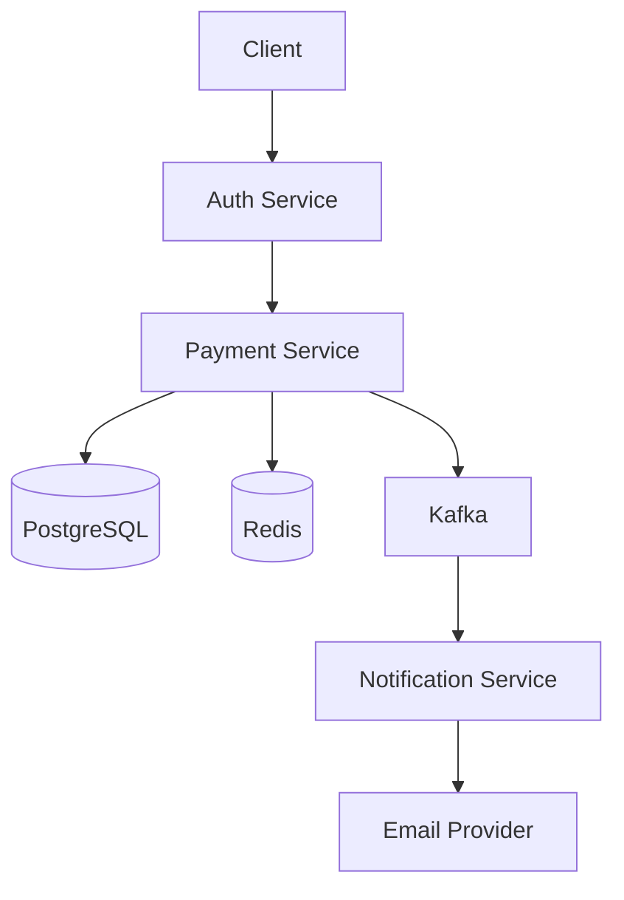
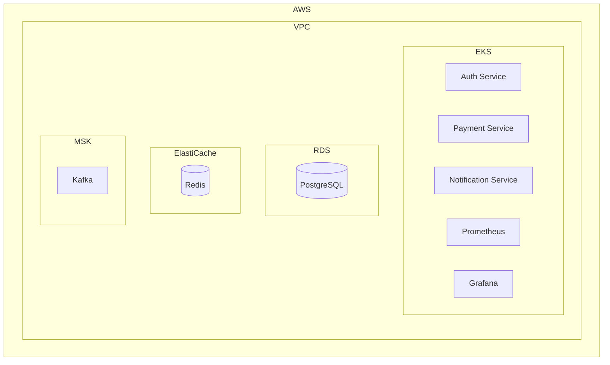

# Payment System - Home Assessment

This project is a home assessment task from a major payment provider, demonstrating a modern microservices-based payment processing system.

## Project Overview

A scalable payment processing system built with microservices architecture, running on AWS infrastructure. The system handles payment processing, user authentication, and notification delivery.

## Architecture

### System Components

1. **Payment Service**
   - Handles payment processing
   - Manages transaction states
   - Integrates with payment providers
   - Provides REST API endpoints

2. **Auth Service**
   - Manages user authentication
   - Handles JWT token generation and validation
   - Provides user management functionality

3. **Notification Service**
   - Handles email notifications
   - Manages notification templates
   - Provides async notification delivery

### Infrastructure

- **Cloud Provider**: AWS
- **Container Orchestration**: Kubernetes (EKS)
- **Database**: PostgreSQL (RDS)
- **Cache**: Redis (ElastiCache)
- **Message Queue**: Kafka (MSK)
- **Monitoring**: Prometheus & Grafana
- **CI/CD**: GitHub Actions
- **GitOps**: ArgoCD

### Architecture Diagrams

#### System Architecture


#### Cloud Infrastructure


## Getting Started

### Prerequisites

- Go 1.24 or later
- Docker
- Kubernetes cluster (minikube/kind for local development)
- AWS CLI (for infrastructure deployment)
- Terraform
- Helm

### Local Development

1. Clone the repository:
```bash
git clone git@github.com:Arsen302/payment-system.git
cd payment-system
```

2. Set up environment variables:
```bash
cp .env.example .env
# Edit .env with your configuration
```

3. Start local development environment:
```bash
make local-up
```

### Deployment

1. Infrastructure deployment:
```bash
cd terraform
terraform init
terraform plan
terraform apply
```

2. Application deployment:
```bash
# Using ArgoCD
kubectl apply -f argocd/applications/
```

## Monitoring

Access monitoring dashboards:
- Grafana: http://localhost:3000 (local) or your Grafana URL
- Prometheus: http://localhost:9090 (local) or your Prometheus URL

## Contributing

1. Create a feature branch
2. Make your changes
3. Submit a pull request

## License

This project is proprietary and confidential.